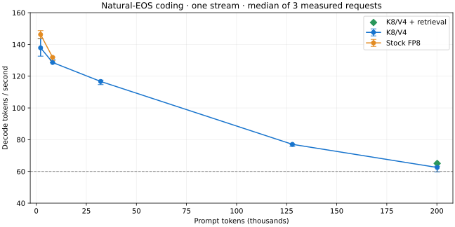

# K8/V4 KV cache for vLLM 0.30 on Intel XPU

Persistent int8-K / int4-V attention for Qwen3.8-27B GPTQ INT4 on two Arc Pro B60s. The serving path is stock vLLM 0.30.0 XPU plus a small dtype registration, a SYCL decode library, oneDNN prefill attention, and an MLP-only W4A8 GEMM. It is a patch on `vllm/vllm-openai-xpu:v0.30.0`, not a vLLM fork, and it is not vLLM's `turboquant_k8v4` selector.

The current deployment uses tensor-parallel 2, MTP with 6 draft tokens, `FULL_DECODE_ONLY` graphs, prefix caching, a **262,144-token request window**, and **four active sequences**. Weights are a local GPTQ INT4 bake (group 128, symmetric, embedding left in int8). This repo does not ship weights.

## Latest: natural-EOS coding at 200K

The new K8/V4 coding curve reaches **62.49 tok/s median at 200,156 prompt tokens**; adding retrieval of constants from the start of the document reaches **65.04 tok/s median**. Each point has one warmup and three measured requests. All answers stop naturally and pass independent behavior checks.

| prompt tokens | K8/V4 median decode | stock FP8 median decode | K8/V4 update gap |
| ---: | ---: | ---: | ---: |
| 2,153 | 137.87 tok/s | 146.26 tok/s | 39.09 ms |
| 8,159 | 128.63 tok/s | 131.89 tok/s | 40.95 ms |
| 32,157 | 116.67 tok/s | not measured | 46.85 ms |
| 127,863 | 77.06 tok/s | not measured | 70.05 ms |
| 200,156 | 62.49 tok/s | not measured | 87.90 ms |
| 200,155 + retrieval | 65.04 tok/s | not measured | 87.89 ms |



The 200K ordinary samples range from 59.67 to 63.28 tok/s. This establishes the target on these tasks, rather than guaranteeing 60 tok/s for every answer or at concurrency four. New FP8 comparisons cover only 2K and 8K. GPU clock ceilings were corrected, but workload and MTP acceptance also changed.

A separate capacity-validation request completed with **261,055 prompt tokens and 405 output tokens**. Its first token arrived after **327.49 seconds**, equivalent to **797.14 prompt tokens/s** including serving overhead. This is one observation; there is no matching pre-clock run at that length. Repeated cached coding requests above do not establish cold-prefill throughput.

The tested native source is now the published source. Stage-2 uses 32 subgroups for the one-row draft and 8 for verification. A slower experimental two-pass merge remains disabled. The new deployment reports **814,581 tokens of shared KV capacity**: four histories near Hermes's half-window compression threshold (~131K each) fit; four fully occupied 262K windows do not.

See the [dated update](docs/2026-09-30-update.md) for raw-data links, source/library hashes, validation, benchmark versus deployment settings, reproduction commands, and Hermes configuration. Earlier workloads and configurations are preserved in the [historical benchmark archive](docs/historical-benchmarks.md).

## Cache space

Full attention on this model is 16 of 64 layers. The other 48 are GDN and are unchanged. After TP=2 each GPU holds 2 KV heads, head dim 256.

| payload, one GPU, one full-attention layer, one token | bytes |
| --- | ---: |
| FP8 K + FP8 V | 1,024 |
| int8 K + packed int4 V + three fp32 scales | 792 |

792 / 1,024 is 22.7% smaller on those layers. The formula lives in `k8v4_v030/layout.py`: `D + V4_COLS + 3 * 4` bytes per head, times 2 local heads. A 64-token page is 50,688 bytes.

Across 16 layers and both GPUs that is 7,424 bytes saved per token.

| context | FP8 attention KV | K8/V4 attention KV | saved |
| ---: | ---: | ---: | ---: |
| 131,072 tokens | 4.00 GiB | 3.09 GiB | 928 MiB |
| 262,144 tokens | 8.00 GiB | 6.19 GiB | 1,856 MiB |

A 4-KV-head page padded out to the one-GPU layout is larger than FP8 on a rank. This build does not use it.

## Serving path

- **Paged K8/V4 decode:** native SYCL attention runs inside `FULL_DECODE_ONLY` graphs. Stage-2 uses 32 subgroups for the one-row draft and 8 for verification, selected independently by the launcher.
- **oneDNN prefill:** one KV head is dequantized at a time for oneDNN Graph SDPA, outside the decode graph. The graph pattern is adapted from [exl3xpu](https://github.com/0xSero/exl3xpu) (`csrc/exl3_ops.sycl`, MIT, Copyright (c) 2026 0xSero).
- **MLP-only W4A8:** large `.mlp.` prefill linears quantize activations to int8. Attention and GDN projections, and small MTP decode linears, keep `int4_gemm_w4a16`.

The [historical benchmark archive](docs/historical-benchmarks.md) preserves the earlier component experiments, forced-token fox curve and BetterBench comparisons. They are separate from the current coding results above.

## Current deployment

- Image: `vllm/vllm-openai-xpu:v0.30.0`, digest `sha256:fc0e112afb64e3a06fe8daff34652435822a629412f38efce8f0f67a46636b8d`, plus this package
- GPUs: 2× Arc Pro B60, `ZE_AFFINITY_MASK=0,1`, composite hierarchy
- Collectives: `CCL_SYCL_ALLREDUCE_LL=twoshots`, simple threshold `4294967296`, copy engine on. The measured host has no Xe Link
- Activations bf16, KV dtype `int8_k_int4_v`, TP 2, max length 262144
- MTP 6, graphs `FULL_DECODE_ONLY`, capture sizes `[7,14,21,28]`
- Prefix caching on, `max-num-seqs` 4, `max-num-batched-tokens` 4224, GPU memory utilization 0.95
- Tool parser `qwen3_xml`, reasoning parser `qwen3`, language-model-only
- Env that selects the three pieces: `K8V4_PREFILL=onednn`, `K8V4_PREFILL_GEMM=w4a8`, `XE2_KV_S2_NSG_DRAFT=32`, `XE2_KV_S2_NSG_VERIFY=8`, `XE2_KV_S2_TWO_PASS=0`. Parallel decode is the library default. Leave `XE2_KV_S2_PARALLEL` unset
- `B70_MTP_BF16_DRAFT=1` and `B70_WORKER_AFFINITY=1` were set on the measured B60 server. The names are historical. `launch.sh` keeps them
- Clocks 400–2400 MHz, burst power limit 180 W, when `xpu-smi` is available
- Chat template in `templates/chat_template.jinja`, mounted over the model template. The curve client sends `enable_thinking=false`

These CCL settings raised GPU faults on this platform and are not in the launch script: `CCL_SYCL_ALLREDUCE_ARC=1`, a simple threshold of 0 or 8192, `CCL_ALLREDUCE=direct`, `CCL_ATL_TRANSPORT=mpi`, `CCL_TOPO_FABRIC_VERTEX_CONNECTION_CHECK=0`.

## How this path was chosen

vLLM owns the block table. Decode is one C++ op per uniform batch. Earlier eager prefill kernels were slower or faulted: untiled SDPA faulted at 16K, query-tiled eager faulted at 96K, online-softmax eager finished 128K at a few hundred tok/s. Fused on-chip decode, chunked stage-1, wider GRF, and fp16 partials were correct and slower than parallel stage-2. Those binaries are not this build.

`patch_installed_vllm.py` adds `int8_k_int4_v` next to the existing cache-dtype list and points the XPU platform at `k8v4_v030.backend.Xe2K8V4AttentionBackend`. Workers import vLLM from site-packages. The image runs that patch at build time.

## On your own tree

Call `python3 -m k8v4_v030.patch_installed_vllm` against the vLLM package you import, or splice the same three sites in `k8v4_v030/patch_installed_vllm.py` (cache dtype list, torch dtype map, XPU backend selector). Ship this package on `PYTHONPATH` and the two libraries from the compile scripts. Then pick the pieces with flags:

- `--kv-cache-dtype int8_k_int4_v` turns on the kernel
- `K8V4_PREFILL=onednn` turns on oneDNN prefill. Unset, prefill stays on the eager path
- `K8V4_PREFILL_GEMM=w4a8` turns on the MLP GEMM. Unset, linears stay w4a16
- `XE2_KV_S2_PARALLEL=0` forces the serial decode kernel, which did not beat FP8 at 128K

Keep capture sizes as multiples of `1 + num_speculative_tokens` (7 when MTP is 6). Keep the manager block a multiple of the 64-token page. The served block is 2112 tokens, 33 pages. Partial pages and prefix caching go through that block table. Query lengths inside the graph are 1 and 7.

## Run it

The two GPUs are exclusive. Stop whatever else is using them before launch. On a host with about 12 GB of RAM, compile while the model is not loaded. The oneAPI image used for compile is large. Compile does not use the GPU. icpx 2025.3 segfaults against this image's `libsycl.so.9`; the compile image copies oneAPI 2026.

```bash
bash k8v4_v030/compile_image.sh
bash k8v4_v030/compile_decode.sh
bash k8v4_v030/compile_sdpa.sh
bash k8v4_v030/build_image.sh
MODEL_DIR=/path/to/Qwen3.8-27B-GPTQ-Int4-baked-v2-embed-int8 bash k8v4_v030/launch.sh
```

`launch.sh` publishes `http://127.0.0.1:8200/v1`, container name `vllm-k8v4-tp2`, restart policy off. Graph capture can take a while. The script waits up to 40 minutes for `/health`.

The checkpoint includes its vision tower. Vision is enabled by default and accepts OpenAI `image_url` content parts. This permits four images per prompt, limits image processing to 1,048,576 pixels, disables video input, and uses a 0.125 GiB processor cache. Set `K8V4_VISION=0` to reproduce the measured text-only configuration. On October 1, after a VM reboot cleared a GPU driver fault, the production server started with these image settings and correctly identified a 64×64 red image through `/v1/chat/completions`. Its startup reported 830,415 tokens of shared KV capacity (3.17 full 262,144-token windows); four full windows still do not fit simultaneously. This is a startup capacity report and a functional image check, not a new performance benchmark. All published benchmark results and the earlier 814,581-token capacity were measured with vision disabled.

The [October 1 runtime update](docs/2026-10-01-runtime.md) documents Hermes low/medium thinking controls, the corrected boot-time GPU limits, and the live memory-pressure investigation.

The current tested decode library hashes to `11535539e01ab3d5b0942911c14c4bb9d8ab0eb855cfd784748a83e33c379498`. The earlier library used by the historical curves hashes to `0b7e2dc92262b1778aadefc8ab71e484408d6b6e90ccb8641616ee078f92623a`. A rebuild can hash differently. The compile script prints the reference hash and does not fail the build on a mismatch.

Overrides, all optional:

| variable | default | role |
| --- | --- | --- |
| `PORT` | 8200 | host port |
| `BIND_HOST` | 127.0.0.1 | publish address |
| `SERVED_NAME` | `Qwen3.8-27B-GPTQ-Int4-baked-v2-embed-int8` | must match the benchmark client |
| `K8V4_CACHE` | `.cache/vllm-k8v4` | prefix-cache directory |
| `K8V4_PREFILL` | `onednn` | prefill attention |
| `K8V4_PREFILL_GEMM` | `w4a8` | MLP GEMM |
| `XE2_KV_S2_NSG` | 32 | parallel stage-2 subgroups |
| `XE2_KV_S2_NSG_DRAFT` | 32 | one-row draft subgroups |
| `XE2_KV_S2_NSG_VERIFY` | 8 | verifier subgroups |
| `XE2_KV_S2_TWO_PASS` | 0 | disabled experimental merge |
| `K8V4_MAX_MODEL_LEN` | 262144 | maximum request window |
| `K8V4_MAX_SEQS` | 4 | active sequence limit and graph sizes |
| `K8V4_GPU_MEMORY_UTILIZATION` | 0.95 | memory budget fraction |
| `K8V4_VISION` | 1 | set to 0 for text-only benchmark reproduction |
| `K8V4_MAX_IMAGES` | 4 | image limit per prompt when vision is enabled |
| `K8V4_MAX_IMAGE_PIXELS` | 1048576 | image processor pixel limit |
| `K8V4_MM_PROCESSOR_CACHE_GB` | 0.125 | multimodal processor cache size |
| `K8V4_MAX_BATCHED_TOKENS` | 4224 | scheduler cap |

New natural-EOS coding curve, concurrency 1:

```bash
python3 bench/serve_coding.py --lengths 2000,8000,32000,127700,200000 --max-tokens 448
python3 bench/serve_coding.py --lengths 200000 --max-tokens 448 --needle
```

The [dated update](docs/2026-09-30-update.md) gives the exact profile used for the recorded curve. The earlier forced-token workload is documented in the [historical archive](docs/historical-benchmarks.md).

CPU checks that do not need a GPU:

```bash
python3 -m unittest k8v4_v030.tests.test_layout_mtp k8v4_v030.tests.test_patch k8v4_v030.tests.test_public_package
```
