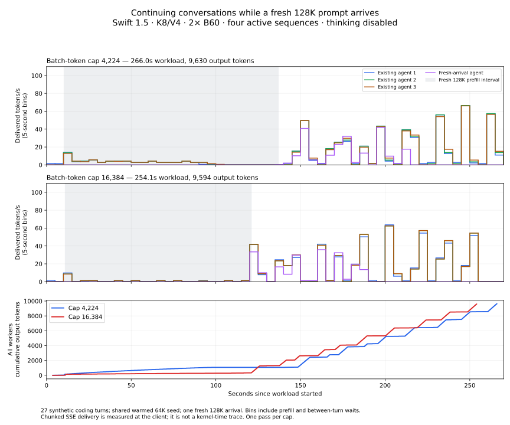

# Prefill batch-size and overlapping agent conversations — October 2, 2026

This measures `--max-num-batched-tokens=4224` against `16384` on the deployed
Swift 1.5 GPTQ INT4 bake, with the Xe2 K8/V4 backend on two Arc Pro B60s.
The image, weights, native library, TP=2, MTP=6, graphs, vision settings,
262,144-token window, four active sequences and GPU settings were preserved.
Only the batch-token cap changed. See the [sanitized configuration](../results/2026-10-02/batch-configuration.json).

The larger cap completed this synthetic multi-turn workload **4.5% sooner**,
with **4.3% higher aggregate output throughput**. It also increased the longest
streaming pause from **5.33 to 15.61 seconds** and reduced reported KV capacity
by 12%. The production default remains **4,224** for responsiveness and capacity;
16,384 is an available throughput tradeoff, rather than a universal improvement.

## Isolated single-request results

Cold prefixes start with a unique marker before the reference context. The
server's cached-prompt counter increased by zero for every fresh request.
Prefill below is actual prompt tokens divided by time to the first positive
completion-token SSE update; it includes serving overhead. Empty role updates
do not stop the timer. Decode excludes the tokens in that first update.
Warmed decode is the median of two repeated requests; answers stop naturally.

| Actual prompt tokens | 4,224 cold TTFT | 16,384 cold TTFT | 4,224 cold prefill tok/s | 16,384 cold prefill tok/s | 4,224 warmed decode tok/s | 16,384 warmed decode tok/s |
| ---: | ---: | ---: | ---: | ---: | ---: | ---: |
| 8,190* | 4.75 s | 4.76 s | 1,724 | 1,722 | 136.38 | 137.41 |
| 64,197 | 46.97 s | 46.38 s | 1,367 | 1,384 | 97.89 | 96.98 |
| 128,197 | 115.41 s | 109.64 s | 1,111 | 1,169 | 74.48 | 79.85 |
| 200,191 | 219.13 s | 204.52 s | 914 | 979 | 61.06 | 61.92 |

The 8K cold row uses a separate fresh-prefix confirmation after the overlap
test, on each cap. The initial 16,384 request took 8.79 seconds during its first
request after startup; that observation remains in the raw data and is not used
as the steady-state cold comparison. No answers were forced past EOS. All 24
requests in the main single-request sweep passed syntax and independent interval
behavior checks.

*The fresh-8K confirmations contain 8,190 prompt tokens; the warmed decode
samples from the main sweep contain 8,192 because their marker differs.*

At 200K, larger chunks reduced cold TTFT by 6.7%. This is one sequential pass
per configuration, rather than a randomized repeated estimate. Small decode
differences include generated-answer and MTP-acceptance variation: identical
sampling settings do not guarantee identical output across prefill shapes.

### Cached prompt processing is a different measurement

Repeated, cached requests at 64K report approximately **21K prompt tokens/s**
when dividing the entire prompt by TTFT. At 200K, that calculation reaches
approximately **29K prompt tokens/s**, even at the original 4,224 cap.
Those requests reuse 61,248 and 196,416 cached prompt tokens respectively.
They do not measure computing every prompt token again. A nonce must precede
the reusable context to invalidate its prefix; appending a nonce can preserve
most of that context. See [vLLM prefix caching](https://docs.vllm.ai/en/latest/features/automatic_prefix_caching/).

The separate dual-B70 screenshot is not an audited run from this server.
Its benchmark script, actual token counts and cache counters are needed to
establish whether its reported 29,242 tok/s at 64K represents cold prefill.
Increasing this server's cap did not reproduce that cold rate.

## Overlapping agent conversations

| Measurement | Cap 4,224 | Cap 16,384 |
| --- | ---: | ---: |
| Entire 27-request workload | 266.01 s | 254.05 s |
| Output tokens | 9,630 | 9,594 |
| Output tokens / entire workload duration | 36.20 tok/s | 37.76 tok/s |
| Fresh 128K arrival: time to first token | 126.66 s | 110.01 s |
| Existing agents: first completed replies, from workload start | 92.33–100.16 s | 125.68–125.95 s |
| Median per-turn time to first token | 7.01 s | 9.71 s |
| Stream-update gap p95 | 2.334 s | 0.144 s |
| Stream-update gap p99 | 3.445 s | 10.724 s |
| Longest stream-update gap | 5.331 s | 15.605 s |
| Peak running / peak waiting requests | 4 / 3 | 4 / 0 |
| Behavioral checks passed | 27 / 27 | 27 / 27 |

The faster long-prefill completion at 16,384 saves the arriving request about
17 seconds to its first token. The existing agents pay for that prioritization:
their first completed replies arrive 26–33 seconds later. Smaller chunks permit
more frequent progress during the cold prefill, while larger chunks produce
fewer but longer pauses. This explains why the larger cap improves p95 stream
gaps while worsening p99 and the maximum. The separate peak running and waiting
counts occurred at different times; there were only four client workers.



The shaded interval ends at the fresh arrival's first positive token. Both
configurations recover delivery speed afterward. The bottom panel shows the
smaller cap producing more output early during the arrival, followed by the
larger cap overtaking it and finishing the whole workflow earlier. Rates are
five-second delivery bins, including waiting between turns. Recovery does not
promise the concurrency-one decode rate while other workers remain active.

The [client](../bench/serve_agentic_batch.py) launches three agents with the
same warmed 64K reference context and an identical prior assistant answer.
Each consumes simulated build-tool results over eight sequential turns. A
fourth conversation arrives with a fresh 128K prompt after all three existing
workers begin streaming, then makes two follow-up turns: **27 requests total**.
Tool results are synthetic; no engine builds or repository actions execute.
The common initial assistant answer comes from the 16,384 single-request
result file for both configurations. Each cap has its 64K prefix primed before
the workload. Subsequent conversation content includes that run's generated
answers, as a real agent conversation would.

These are concise natural-EOS Python coding answers, temperature zero and
thinking disabled, with a 768-token maximum per turn. They assess overlapping
prefill/decode and conversation-prefix reuse. They do not establish production
thinking latency, four independent fully occupied 262K histories, image speed,
or the throughput of a different tool workload. Aggregate output rate includes
the initial cold-arrival prefill and all sequential-turn waits.

The metric watcher polls every half second. Stream-gap percentiles pool
positive-token update intervals across requests; they include chunked MTP
delivery and prefill scheduling pauses, rather than per-token kernel timings.
Metric counter deltas during overlap describe the entire workload, not an
individual worker's cache hits or speculative acceptance.

## Capacity and deployment

The 4,224 startup reported **869,121 shared KV tokens** (13.08 GiB available
cache memory on the reported worker; 13.09 GiB on the restoration); the 16,384
startup reported **765,319** (11.54 GiB), a 12% capacity
reduction. Startup encoder profiling also increased from the smaller token
budget to 16,384. Four histories near Hermes's half-window compression point
fit in either reported pool; four fully occupied 262K windows do not.

The original 4,224 production container was restored, its health check passed,
and temporary model-API isolation was removed. Room agents and the CI runner
were left stopped as requested; automatic disk maintenance was restored.
No weights, attention code, Hermes thinking settings or context limit changed
in this experiment. GPU configuration remained 400–2400 MHz and 180 W burst
on each B60. The native decode-library SHA-256 is
`11535539e01ab3d5b0942911c14c4bb9d8ab0eb855cfd784748a83e33c379498`.

## Reproduction and raw records

Use the same launch image and arguments, changing only
`K8V4_MAX_BATCHED_TOKENS=4224` or `16384`. Stop other model clients and begin with
a new server process/cache for each main single-request sweep:

```bash
python bench/serve_coding.py \
  --base http://127.0.0.1:8100 \
  --model Swift-1.5-Qwen3.8-27b-GPTQ-Int4-baked-v1-embed-int8 \
  --lengths 8000,64000,128000,200000 --repeats 2 \
  --cold-prefix batch-c1-20261002-cap4224-unique-a1 > cap-C1.jsonl
```

Use the same fresh marker in the new server process for the second cap.
For overlap, retain or prime the same 64K prompt prefix. The recorded 16,384
single-request result file supplies the same assistant seed to both runs:

```bash
python bench/serve_agentic_batch.py --cap 4224 \
  --coding-script bench/serve_coding.py \
  --seed-results results/2026-10-02/batch16384-coding-c1.jsonl > agentic4224.jsonl
# Repeat on the 16,384 server, changing --cap and the output filename.
```

`--cap` labels a measurement; it does not reconfigure the server. The measured
server was restarted between configurations. The 4,224 overlap run primed the
64K prompt again after that restart, before measuring the 27-request workload.

- [4,224 single-request records](../results/2026-10-02/batch4224-coding-c1.jsonl)
- [16,384 single-request records](../results/2026-10-02/batch16384-coding-c1.jsonl)
- [16,384 overlap records](../results/2026-10-02/batch16384-agentic.jsonl)
- [4,224 overlap records](../results/2026-10-02/batch4224-agentic.jsonl)
- [4,224 prefix-priming record after restart](../results/2026-10-02/batch4224-agentic-prime.jsonl)
- [4,224 fresh-8K confirmation](../results/2026-10-02/batch4224-cold8k-confirm.jsonl)
- [16,384 fresh-8K confirmation](../results/2026-10-02/batch16384-cold8k-confirm.jsonl)

The public records contain synthetic prompts, responses, stream timestamps,
behavior checks and relevant metrics. Full private container inspection and
credentials are excluded.
