# Historical benchmarks: earlier fox and BetterBench workloads

These are preserved measurements from the earlier serving profile, not the
current performance table. The fox curve uses `ignore_eos` and forces 96
completion tokens; some completions include post-EOS control tokens. The
current natural-EOS coding curve uses a different workload, library and
configuration. Do not combine their rows or infer a clock-only speedup.

For current results, see the [README](../README.md) and
[September 30 update](2026-09-30-update.md). Detailed historical tables remain
in [RESULTS.md](../RESULTS.md); their raw data and charts are retained.

## Historical measurements: three pieces

The served stack is the sum of three switches. They were measured separately. Each row below is its own boot, one 96-token sample, not a factorial grid from a single process.

**1. K8/V4 kernel.** Paged int8 K and int4 V, native SYCL decode, replayed inside `FULL_DECODE_ONLY`. Parallel stage-2 uses 32 subgroups on one live query row (`XE2_KV_S2_NSG=32`). Serial stage-2 at 128K scored 33.6 tok/s and did not beat FP8 at 35.2. Parallel stage-2 is the decode path that holds the long-context step. A padded 128K query of length 7 dropped from about 2668 µs to about 1743–1789 µs.

**2. oneDNN prefill.** Prefill stays outside the XPU graph. One KV head is dequantized at a time, then an oneDNN Graph SDPA runs over the logical sequence. The graph pattern is adapted from [exl3xpu](https://github.com/0xSero/exl3xpu) (`csrc/exl3_ops.sycl`, MIT, Copyright (c) 2026 0xSero). Eager online-softmax prefill on this cache was 796 tok/s at 2K and about 320 / 260 tok/s on long prompts. Plain oneDNN, still on w4a16 GEMMs, reached about 1,394 tok/s at the 64K fox prompt (1,389 tok/s and 46 s on the unprofiled profile boot).

**3. MLP-only W4A8.** Prefill linears whose module name contains `.mlp.` and whose row count is above 128 quantize activations to int8. Attention projections, GDN projections, and MTP decode (M ≤ 128) stay on `int4_gemm_w4a16`. Turning W4A8 on for every large GEMM reached 2,276 tok/s at 2K and 1,732 tok/s at 64K, and short decode fell to 72 tok/s at acceptance 0.328. That combination is not the default. The MLP gate is what kept an empty-context probe near 130 tok/s.

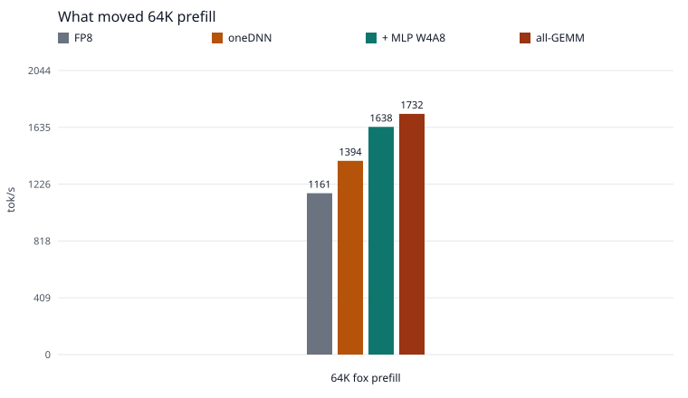

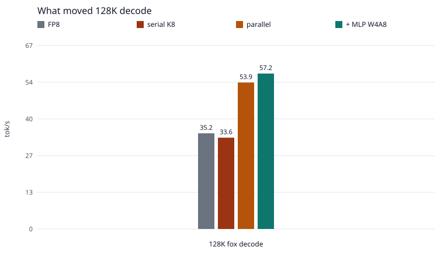

| piece | 64K fox prefill | 128K fox decode | 128K step |
| --- | ---: | ---: | ---: |
| FP8, FlashAttention, w4a16 | 1,161 tok/s | 35.2 tok/s | 73.3 ms |
| K8/V4 serial + oneDNN, no W4A8 |  | 33.6 tok/s |  |
| K8/V4 parallel + oneDNN, no W4A8 | 1,394 tok/s | 53.9 tok/s | 70.3 ms |
| parallel + oneDNN + MLP W4A8 (served) | 1,638 tok/s | 57.2 tok/s | 71.9 ms |
| parallel + oneDNN + all-GEMM W4A8 | 1,732 tok/s | short decode 72 tok/s |  |

Read the 64K column down for prefill, and the 128K column down for decode. oneDNN is the first prefill step above FP8. MLP W4A8 adds the next prefill step (1,394 to 1,638) without giving up the parallel decode step. All-GEMM adds a bit more prefill and loses short-context acceptance, so it stays off. The 57.2 versus 53.9 tok/s gap is acceptance on those samples. The parallel oneDNN step, 70.3 ms, is the fastest 128K step that was recorded. The served step is 71.9 ms.

A 64K oneDNN profile, rank 0, each kernel once, with the profiler attached (the client then read 782 tok/s, which is not the serving speed):

| device time | seconds |
| --- | ---: |
| GPTQ `int4_gemm_w4a16` | 21.1 |
| TP2 two-shot all-reduce | 8.7 |
| oneDNN SDPA | 8.8 |
| GDN | 1.9 |

Linears dominate. The all-reduce is second. MLP W4A8 takes part of the GEMM and leaves the attention and GDN projections on w4a16. At 63,932 tokens on the served stack, prefill attention was 10.7 s of a 39.0 s time to first token. At 127,853 tokens it was 40.7 s of 97.4 s.

## Historical single stream

Concurrency 1, temperature 0, 96 decode tokens with `ignore_eos`, the fox prompt in `bench/held_curve.py`. These earlier runs used a 131072 window, eight sequences, 8192 batch tokens and utilization 0.90. Prefill tok/s is prompt tokens / time to first token. Decode tok/s is the 96 completion tokens after that. The step is the gap between streamed updates. K8/V4 rows are `results/k8v4-held-c1.jsonl`. FP8 rows are the stock server on the same prompts (`results/fp8-held-c1.json`).

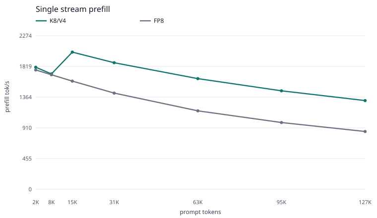

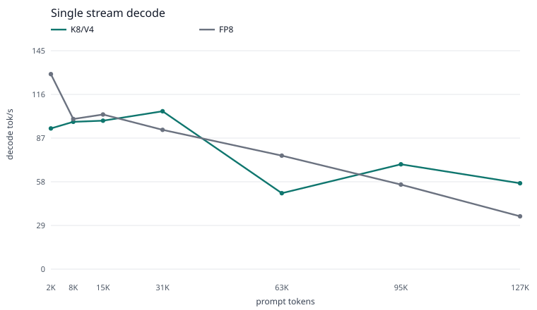

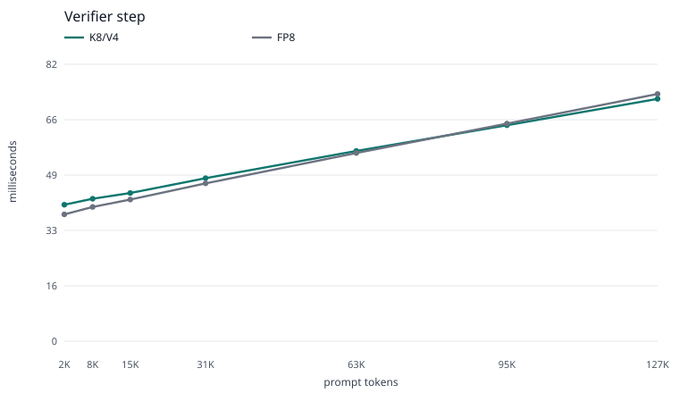

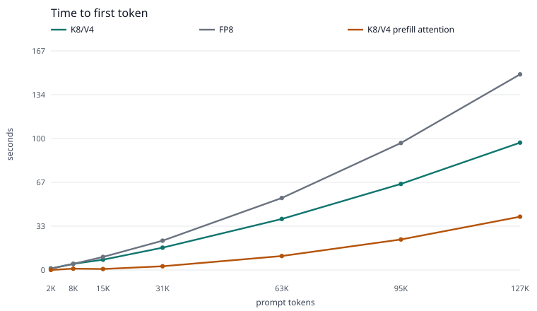

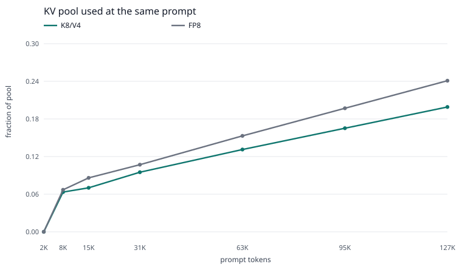

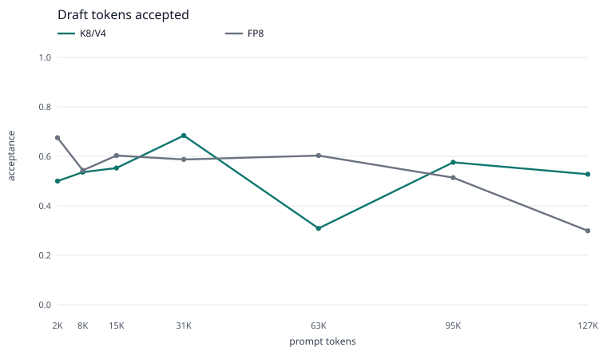

| prompt | K8 prefill | FP8 prefill | K8 decode | FP8 decode | K8 step | FP8 step | K8 accept | FP8 accept |
| ---: | ---: | ---: | ---: | ---: | ---: | ---: | ---: | ---: |
| 2,001 | 1,806 | 1,766 | 93.7 | 129.9 | 40.5 ms | 37.6 ms | 75/150 (0.500) | 77/114 (0.675) |
| 8,001 | 1,707 | 1,695 | 98.2 | 100.0 | 42.2 ms | 39.8 ms | 74/138 (0.536) | 75/138 (0.543) |
| 15,992 | 2,030 | 1,601 | 98.9 | 103.0 | 43.9 ms | 42.0 ms | 73/132 (0.553) | 76/126 (0.603) |
| 31,972 | 1,874 | 1,424 | 105.2 | 92.8 | 48.3 ms | 46.8 ms | 78/114 (0.684) | 74/126 (0.587) |
| 63,932 | 1,638 | 1,161 | 50.6 | 75.6 | 56.4 ms | 55.8 ms | 63/204 (0.309) | 76/126 (0.603) |
| 95,892 | 1,457 | 988 | 69.8 | 56.3 | 64.0 ms | 64.5 ms | 76/132 (0.576) | 74/144 (0.514) |
| 127,853 | 1,313 | 855 | 57.2 | 35.2 | 71.9 ms | 73.3 ms | 76/144 (0.528) | 61/204 (0.299) |

Exact K8 rates: 1806.42 / 93.72, 1707.45 / 98.15, 2030.25 / 98.88, 1873.56 / 105.18, 1637.92 / 50.61, 1457.40 / 69.84, 1312.88 / 57.22.

Time to first token at 127,853 tokens was 97.4 s on K8/V4 and 149.5 s on FP8. At 63,932 tokens it was 39.0 s versus 55.1 s. Every secret was in the text. The first eight token ids match FP8 at every length. Several completions on both servers then spend tokens on `<|im_start|>`.

The 2,001-token decode (93.7 tok/s) is three tokens per update against FP8's six. The same prompt on that boot scored 102.5 tok/s at 40.3 ms with four tokens per update. An empty-context probe on an earlier boot of this stack was 130.1 tok/s, 40.7 ms, six tokens per update, acceptance 0.722. The step at 2K is 40.5 ms against FP8's 37.6 ms.

The 63,932-token decode (50.6 tok/s) is acceptance 0.309 on one 96-token sample. The step, 56.4 ms, matches FP8's 55.8 ms. Another boot of the same stack scored 72.2 tok/s at 56.2 ms when acceptance was 0.493. The long-context question of record is the 127,853-token point: **57.2 tok/s at 71.9 ms**. That is ahead of FP8 at 35.2 tok/s and 73.3 ms, and short of a 60–80 tok/s target. 64K prefill at 1,638 tok/s is ahead of FP8 at 1,161 and short of 2,000.

Decode attention inside the graph was not timed. `FULL_DECODE_ONLY` replays the kernel without re-entering the Python wrapper, so the attention counter stays at 0 calls. The verifier step is the decode-time measurement. Prefill attention on the chart is the host timer around oneDNN SDPA.

Clocks were 2400/2400 except the 16K prefill (1717/1750) and the 96K prefill (2350/1850). Power on the K8/V4 points peaked around 155–160 W. The long-context falloff is not the GPU sitting under its cap.

## Historical BetterBench concurrency

BetterBench 0.6.0, corpus v1.0 hash `e332dceff176d033`, `--quick` (5 passes, 1 warmup), greedy, cold prefix, context 131072, 48 requests at each concurrency, all 48 completed. Same model, TP2, MTP6, `FULL_DECODE_ONLY`, `max-num-seqs` 8, prefix caching. The K8/V4 run is the served stack (MLP W4A8, oneDNN, parallel decode).

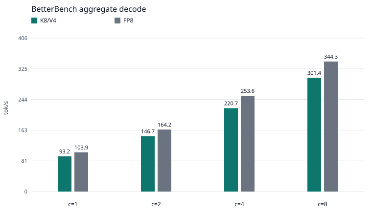

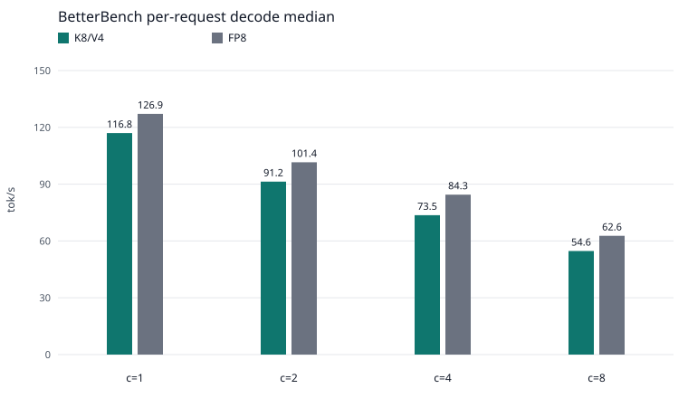

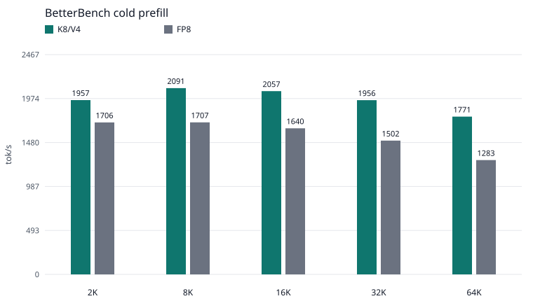

| | FP8 | K8/V4 |
| --- | ---: | ---: |
| combined decode | 118.5 tok/s | 108.0 tok/s |
| update p99 | 37.0 ms | 40.5 ms |
| TTFT p50 | 140 ms | 183 ms |
| aggregate at concurrency 8 | 344.3 tok/s | 301.4 tok/s |
| prefill at 47,044 tokens | 1,283 tok/s | 1,771 tok/s |

| concurrency | FP8 aggregate | K8 aggregate | FP8 per request | K8 per request | FP8 scaling | K8 scaling |
| ---: | ---: | ---: | ---: | ---: | ---: | ---: |
| 1 | 103.9 | 93.2 | 126.9 | 116.8 | 1.00 | 1.00 |
| 2 | 164.2 | 146.7 | 101.4 | 91.2 | 1.58 | 1.57 |
| 4 | 253.6 | 220.7 | 84.3 | 73.5 | 2.44 | 2.37 |
| 8 | 344.3 | 301.4 | 62.6 | 54.6 | 3.31 | 3.23 |

Scaling is aggregate(c) / aggregate(1). The shape matches. K8/V4 sits about 10–13% lower on decode aggregate and is faster at every prefill depth in this corpus. Tokens per update stay close (code 4.15 on both, file edit 5.44 versus 5.42). Reasoning is the category where the K8/V4 median is ahead (98.2 versus 96.5). Category tables are in [RESULTS.md](../RESULTS.md).

BetterBench's 64K depth is 47,044 tokens, not the fox prompt's 63,932. 1,771 tok/s there is the corpus number. 1,638 tok/s is the fox number.

## Historical KV pool and resident memory

At that 127,853-token prompt the server reported KV-pool usage of **0.199** on K8/V4 and **0.241** on FP8. The pool shrinks by less than 22.7% because GDN state is still there and the attention block is 2112 tokens here versus 1664 on the FP8 server. Resident memory stays about 23 GiB either way: the K8/V4 peak on that prompt was 23,583 / 23,223 MiB, and FP8 sat at 23,002 / 22,638 MiB for the whole curve. The win is free pool, not a smaller process.

## Earlier stock FP8 prefill experiments

Stock FP8 prefill was checked one variable at a time before this kernel's prefill was changed. Batch tokens 8192 versus 4096 did not move it (speculative decoding already clamps the schedule). Prefix caching off did not move it. `kv-cache-dtype=auto` (bf16 KV) went from 1,680 to 1,764 tok/s at ~8K and from 1,288 to 1,517 at ~47K, and the attention block shrank from 1664 to 832, cutting pool capacity. Clocks were already 2400 MHz. The short FP8 ceiling on this host stays near 1.6–1.8k tok/s. A dual-B70 reference with a faster interconnect is higher (about 2,440 tok/s at one user on a short prefill, climbing toward 2,900 at eight). That gap is the GEMM plus the PCIe all-reduce, which is why W4A8 and the two-shot path matter more here than another attention tile.

## Reading the historical result

Long context is where the smaller cache and the parallel kernel show up: at 127,853 tokens, prefill 1,313 versus 855 tok/s and decode 57.2 versus 35.2 tok/s, with the step still about 72 ms. Short single-stream decode and the BetterBench concurrency aggregates stay a little behind FP8, mostly from draft acceptance and a few milliseconds of step. The three switches above are the whole serving difference from stock FP8.
